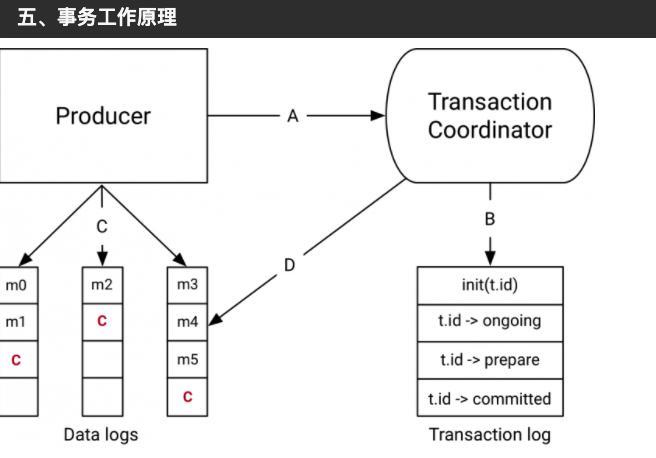
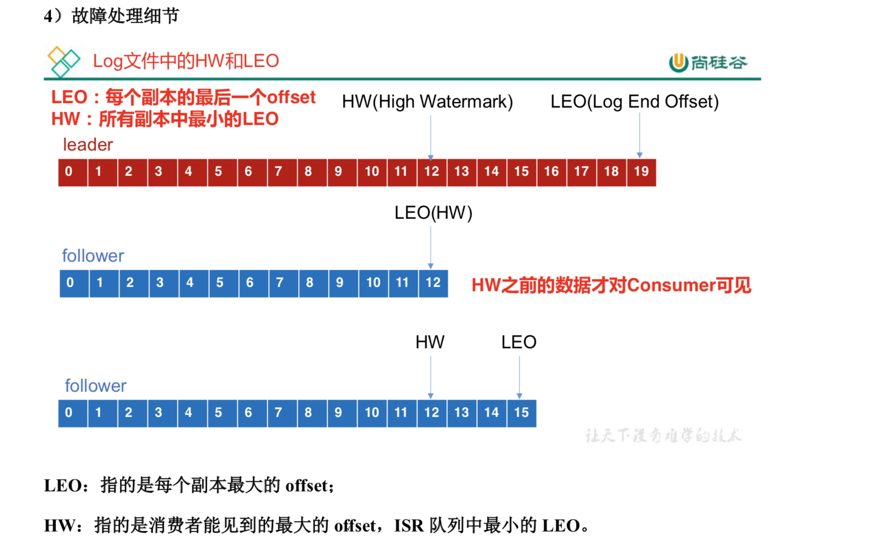
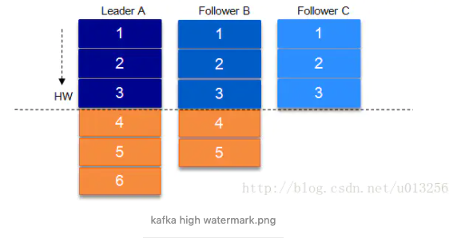
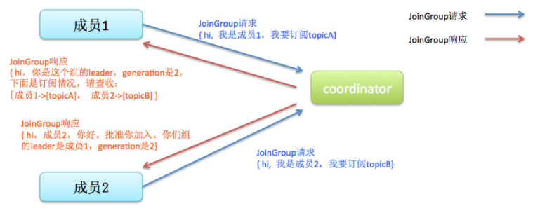
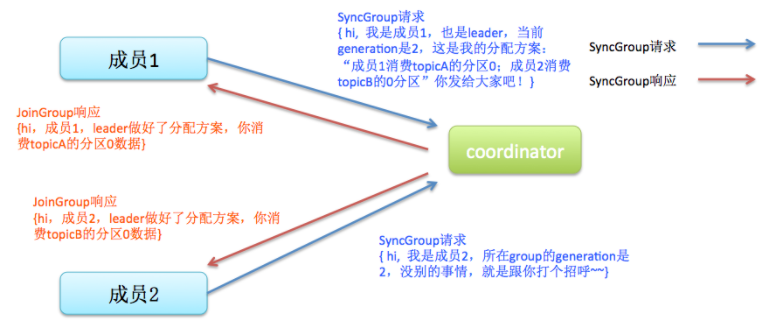
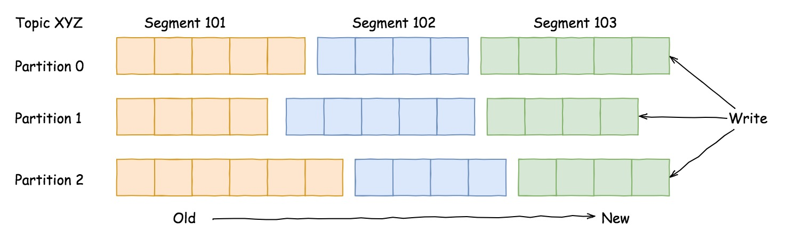
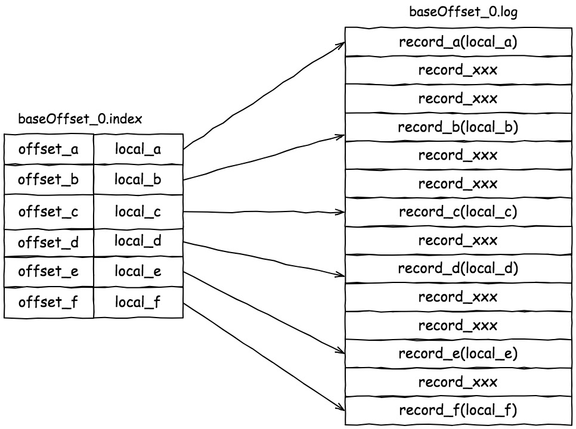
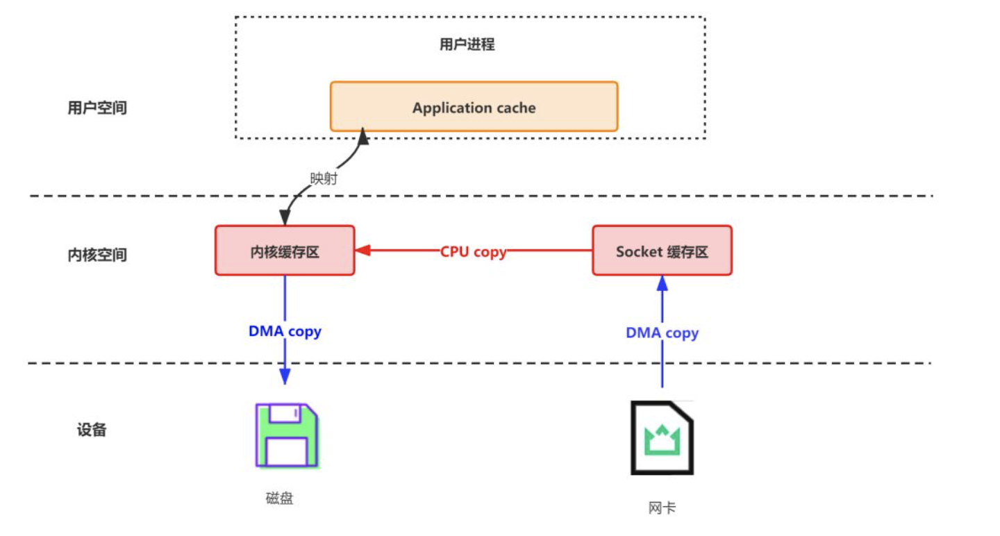
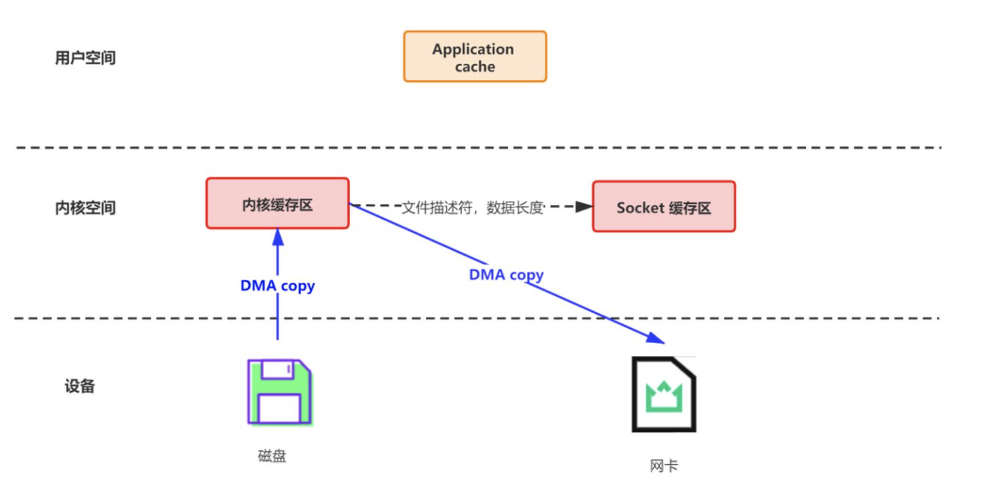

# 问题

## 分布式环境使用kafka事务??


# kafka学习笔记

* 相关练习在 demo001 中
* 本篇笔记主要参考资料：https://www.orchome.com/303

## producer 中 acks 参数的含义

- **acks=0** The producer never waits for an ack from the broker when the ack value is set to 0. No guarantee can be made that the broker has received the message. The producer doesn’t try to send the record again since the producer never knows that the record was lost. This setting provides lower latency and higher throughput at the cost of much higher risk of message loss.
- **acks=1** When setting the ack value to 1, the producer gets an ack after the leader has received the record.The leader will write the record to its log but will respond without awaiting a full acknowledgment from all followers. **The message will be lost only if the leader fails immediately after acknowledging the record, but before the followers have replicated it. （kafka集群中如果leader在  *响应了消息后，follower复制消息前* 挂了，会导致消息丢失）**This setting is the middle ground for latency, throughput, and durability. It is slower but more durable than acks=0.
- **acks=all** Setting the ack value to all means that the producer gets an ack when all in-sync replicas have received the record. The leader will wait for the full set of in-sync replicas to acknowledge the record. This means that it takes a longer time to send a message with ack value all, but it gives the strongest message durability.

## auto.offset.reset 配置 latest & earliest

```java
/**
         * What to do when there is no initial offset in Kafka or if the current offset does not exist any more on the server
         * (e.g. because that data has been deleted):
         * <ul>
         * <li>earliest: automatically reset the offset to the earliest offset
         * <li>latest: automatically reset the offset to the latest offset</li>
         * <li>none: throw exception to the consumer if no previous offset is found for the consumer's group</li>
         * <li>anything else: throw exception to the consumer.
         *
         * latest和earliest区别
         *
         * 1，earliest 当各分区下有已提交的offset时，从提交的offset开始消费；无提交的offset时，从头开始消费
         *
         * 2，latest 当各分区下有已提交的offset时，从提交的offset开始消费；无提交的offset时，消费新产生的该分区下的数据
         *
         * 提交过offset，latest和earliest没有区别，但是在没有提交offset情况下，用latest直接会导致无法读取旧数据。
         */
        props.put("auto.offset.reset","latest");
```


## [kafka客户端发布`record(消息)`到kafka集群。](https://www.orchome.com/303)

>**`producer`(生产者)缓存每个分区未发送的消息。缓存的大小是通过 `batch.size` 配置指定的。值较大的话将会产生更大的批。并需要更多的内存（因为每个“活跃”的分区都有1个缓冲区）。**
>
>默认缓冲可立即发送，即便缓冲空间还没有满，但是，如果你想减少请求的数量，可以设置`linger.ms`大于0。这将指示生产者发送请求之前等待一段时间，希望更多的消息填补到未满的批中。这类似于TCP的算法，例如上面的代码段，可能100条消息在一个请求发送，因为我们设置了linger(逗留)时间为1毫秒，然后，如果我们没有填满缓冲区，这个设置将增加1毫秒的延迟请求以等待更多的消息。需要注意的是，在高负载下，相近的时间一般也会组成批，即使是 `linger.ms=0`。在不处于高负载的情况下，如果设置比0大，以少量的延迟代价换取更少的，更有效的请求。
>
>`buffer.memory` 控制生产者可用的缓存总量，**如果消息发送速度比其传输到服务器的快(即产生消息的速度快于发送到服务器的速度)，将会耗尽这个缓存空间。当缓存空间耗尽，其他发送调用将被阻塞，阻塞时间的阈值通过`max.block.ms`设定，之后它将抛出一个TimeoutException**。

## kafka 事务机制

* [kafka系列九、kafka事务原理、事务API和使用场景](https://www.cnblogs.com/wangzhuxing/p/10125437.html)  (写得不好，不容易理解)

>### 2.2. 粉碎“僵尸实例”
>
>我们通过为每个事务Producer分配一个称为transactional.id的唯一标识符来解决僵尸实例的问题。在进程重新启动时能够识别相同的Producer实例。
>
>API要求事务性Producer的第一个操作应该是在Kafka集群中显示注册transactional.id。 当注册的时候，Kafka broker用给定的transactional.id检查打开的事务并且完成处理。 Kafka也增加了一个与transactional.id相关的epoch。Epoch存储每个transactional.id内部元数据。
>
>一旦这个epoch被触发，任何具有相同的transactional.id和更旧的epoch的Producer被视为僵尸，并被围起来, Kafka会拒绝来自这些Procedure的后续事务性写入。
>
>事务调用之前先进行初始化， TransactionManager.initializeTransactions()
>
>org.apache.kafka.clients.producer.internals.TransactionManager#initializeTransactions(org.apache.kafka.common.utils.ProducerIdAndEpoch)
>
>```java
>synchronized TransactionalRequestResult initializeTransactions(ProducerIdAndEpoch producerIdAndEpoch) {
>    boolean isEpochBump = producerIdAndEpoch != ProducerIdAndEpoch.NONE;
>    return handleCachedTransactionRequestResult(() -> {
>        // If this is an epoch bump, we will transition the state as part of handling the EndTxnRequest
>        if (!isEpochBump) {
>            transitionTo(State.INITIALIZING);
>            log.info("Invoking InitProducerId for the first time in order to acquire a producer ID");
>        } else {
>            log.info("Invoking InitProducerId with current producer ID and epoch {} in order to bump the epoch", producerIdAndEpoch);
>        }
>        InitProducerIdRequestData requestData = new InitProducerIdRequestData()
>                .setTransactionalId(transactionalId)
>                .setTransactionTimeoutMs(transactionTimeoutMs)
>                .setProducerId(producerIdAndEpoch.producerId)
>                .setProducerEpoch(producerIdAndEpoch.epoch);
>        InitProducerIdHandler handler = new InitProducerIdHandler(new InitProducerIdRequest.Builder(requestData),
>                isEpochBump);
>        enqueueRequest(handler);
>        return handler.result;
>    }, State.INITIALIZING);
>}
>```
>
>### 2.3. 读事务消息
>
>现在，让我们把注意力转向数据读取中的事务一致性。
>
>Kafka Consumer 只有在事务实际提交时才会将事务消息传递给应用程序。也就是说，Consumer不会提交作为整个事务一部分的消息，也不会提交属于中止事务的消息。
>
>值得注意的是，**上述保证不足以保证整个消息读取的原子性，当使用Kafka consumer来消费来自topic的消息时，应用程序将不知道这些消息是否被写为事务的一部分，因此他们不知道事务何时开始或结束；此外，给定的Consumer不能保证订阅属于事务一部分的所有Partition，并且无法发现这一点，最终难以保证作为事务中的所有消息被单个Consumer处理。**
>
>简而言之：Kafka保证Consumer最终只能提供非事务性消息或提交事务性消息。它将保留来自未完成事务的消息，并过滤掉已中止事务的消息。
>
>### 事务协调器和事务日志
>
>
>
>Kafka 0.11.0中与事务API一起引入的组件是上图右侧的事务Coordinator和事务日志。
>
>事务Coordinator是每个KafkaBroker内部运行的一个模块。事务日志是一个内部的Kafka Topic。每个Coordinator拥有事务日志所在分区的子集，即, 这些borker中的分区都是Leader。
>
>每个transactional.id都通过一个简单的哈希函数映射到事务日志的特定分区，事务日志文件__transaction_state-0。这意味着只有一个Broker拥有给定的transactional.id。
>
>通过这种方式，我们利用Kafka可靠的复制协议和Leader选举流程来确保事务协调器始终可用，并且所有事务状态都能够持久存储。
>
>值得注意的是，事务日志只保存事务的最新状态而不是事务中的实际消息。消息只存储在实际的Topic的分区中。事务可以处于诸如“Ongoing”，“prepare commit”和“Completed”之类的各种状态中。正是这种状态和关联的元数据存储在事务日志中。
>
>### 3、**Consumer configs**
>
>1、isolation.level
>
>- read_uncommitted: 以偏移顺序使用已提交和未提交的消息。
>- read_committed: 仅以偏移量顺序使用非事务性消息或已提交事务性消息。为了维护偏移排序，这个设置意味着我们必须在使用者中缓冲消息，直到看到给定事务中的所有消息。

[kafka幂等性和事务使用及实现原理](http://trumandu.github.io/2019/07/08/kafka%E5%B9%82%E7%AD%89%E6%80%A7%E5%92%8C%E4%BA%8B%E5%8A%A1%E4%BD%BF%E7%94%A8%E5%8F%8A%E5%AE%9E%E7%8E%B0%E5%8E%9F%E7%90%86/)（写得不好，少看）

>### Producer 幂等性
>
>Producer 的幂等性指的是当发送同一条消息时，数据在 Server 端只会被持久化一次，数据不丟不重，但是这里的幂等性是有条件的：
>
>- 只能保证 Producer 在单个会话内不丟不重，如果 Producer 出现意外挂掉再重启是无法保证的（幂等性情况下，是无法获取之前的状态信息，因此是无法做到跨会话级别的不丢不重）;
>- 幂等性不能跨多个 Topic-Partition，只能保证单个 partition 内的幂等性，当涉及多个 Topic-Partition 时，这中间的状态并没有同步。
>
>如果需要跨会话、跨多个 topic-partition 的情况，需要使用 Kafka 的事务性来实现。
>
>使用方式：`props.put(ProducerConfig.ENABLE_IDEMPOTENCE_CONFIG, "true");`
>
>当幂等性开启的时候acks即为all。如果显性的将acks设置为0，-1，那么将会报错`Must set acks to all in order to use the idempotent producer. Otherwise we cannot guarantee idempotence.`
>
>### 幂等性原理
>
>幂等性是通过两个关键信息保证的，PID(Producer ID)和sequence numbers。
>
>- **PID 用来标识每个producer client**
>- **sequence numbers 客户端发送的每条消息都会带相应的 sequence number，Server 端就是根据这个值来判断数据是否重复**
>
>**producer 初始化会由server端生成一个PID, 然后发送每条信息都包含该PID和sequence number**，在server端，是按照partition 同样存放一个 sequence numbers 信息，通过判断客户端发送过来的sequence number与server端number+1差值来决定数据是否重复或者漏掉。
>
>通常情况下为了保证数据顺序性，我们可以通过 `max.in.flight.requests.per.connection=1`来保证，这个也只是针对单实例。在kafka2.0+版本上，**只要开启幂等性，不用设置这个参数也能保证发送数据的顺序性。**
>
>### 事务实现原理
>
>###### (1)查找TransactionCoordinator
>
>通过 transaction_id 找到 TransactionCoordinator，具体算法是`Utils.abs(transaction_id.hashCode %transactionTopicPartitionCount )`，获取到 partition，再找到该 partition的leader,即为 TransactionCoordinator。
>
>###### (2)获取PID
>
>凡是开启幂等性都是需要生成PID(Producer ID), 只不过未开启事务的PID可以在任意broker生成，而**开启事务只能在TransactionCoordinator节点生成。**这里只讲开启事务的情况，Producer Client的`initTransactions()`方法会向TransactionCoordinator发起InitPidRequest ，这样就能获取PID。这里面还有一些细节问题，这里不探讨，例如transaction_id 之前的事务状态什么的。但需要说明的一点是这里**会将 transaction_id 与相应的 TransactionMetadata 持久化到事务日志**（_transaction_state）中。
>
>###### (3)开启事务
>
>Producer调用`beginTransaction`开始一个事务状态，这里只是在客户端将本地事务状态转移成 IN_TRANSACTION，只有在发送第一条信息后，TransactionCoordinator 才会认为该事务已经开启。

---------

## [Kafka设计解析（八）- Exactly Once语义与事务机制原理](https://www.cnblogs.com/jasongj/p/7912348.html)（很详细）

## 3 实现事务机制的几个阶段

###  3.1 幂等性发送

上文提到，实现`Exactly Once`的一种方法是让下游系统具有幂等处理特性，而在 Kafka Stream 中，Kafka Producer 本身就是“下游”系统，因此如果能让Producer具有幂等处理特性，那就可以让Kafka Stream在一定程度上支持`Exactly once`语义。

为了实现Producer的幂等语义，Kafka引入了`Producer ID`（即`PID`）和`Sequence Number`。每个新的Producer在初始化的时候会被分配一个唯一的PID，该PID对用户完全透明而不会暴露给用户。

对于每个PID，该Producer发送数据的每个``都对应一个从0开始单调递增的`Sequence Number`。

类似地，Broker端也会为每个``维护一个序号，并且每次Commit一条消息时将其对应序号递增。对于接收的每条消息，如果其序号比Broker维护的序号（即最后一次Commit的消息的序号）大一，则Broker会接受它，否则将其丢弃：

- 如果消息序号比Broker维护的序号大一以上，说明中间有数据尚未写入，也即乱序，此时Broker拒绝该消息，Producer抛出`InvalidSequenceNumber`
- 如果消息序号小于等于Broker维护的序号，说明该消息已被保存，即为重复消息，Broker直接丢弃该消息，Producer抛出`DuplicateSequenceNumber`

**上述设计解决了0.11.0.0之前版本中的两个问题：**

- **Broker保存消息后，发送ACK前宕机，Producer认为消息未发送成功并重试，造成数据重复**
- **前一条消息发送失败，后一条消息发送成功，前一条消息重试后成功，造成数据乱序**

- ## 3.2 事务性保证

  **上述幂等设计只能保证单个Producer对于同一个<Topic, Partition>的`Exactly Once`语义。**

  **另外，它并不能保证写操作的原子性——即多个写操作，要么全部被Commit要么全部不被Commit。**

  **更不能保证多个读写操作的的原子性。**尤其对于Kafka Stream应用而言，典型的操作即是从某个Topic消费数据，经过一系列转换后写回另一个Topic，保证从源Topic的读取与向目标Topic的写入的原子性有助于从故障中恢复。

  事务保证可使得应用程序将生产数据和消费数据当作一个原子单元来处理，要么全部成功，要么全部失败，即使该生产或消费跨多个`<Topic, Partition>`。

  另外，有状态的应用也可以保证重启后从断点处继续处理，也即事务恢复。

  为了实现这种效果，应用程序必须提供一个稳定的（重启后不变）唯一的ID，也即`Transaction ID`。`Transactin ID`与`PID`可能一一对应。区别在于`Transaction ID`由用户提供，而`PID`是内部的实现对用户透明。

  另外，为了保证新的Producer启动后，旧的具有相同`Transaction ID`的Producer即失效，每次Producer通过`Transaction ID`拿到PID的同时，还会获取一个单调递增的epoch。由于旧的Producer的epoch比新Producer的epoch小，Kafka可以很容易识别出该Producer是老的Producer并拒绝其请求。

  有了`Transaction ID`后，Kafka可保证：

  - 跨Session的数据幂等发送。当具有相同`Transaction ID`的新的Producer实例被创建且工作时，旧的且拥有相同`Transaction ID`的Producer将不再工作。
  - 跨Session的事务恢复。如果某个应用实例宕机，新的实例可以保证任何未完成的旧的事务要么Commit要么Abort，使得新实例从一个正常状态开始工作。

  需要注意的是，上述的事务保证是从Producer的角度去考虑的。从Consumer的角度来看，该保证会相对弱一些。尤其是不能保证所有被某事务Commit过的所有消息都被一起消费，因为：

  - 对于压缩的Topic而言，同一事务的某些消息可能被其它版本覆盖
  - 事务包含的消息可能分布在多个Segment中（即使在同一个Partition内），当老的Segment被删除时，该事务的部分数据可能会丢失
  - Consumer在一个事务内可能通过seek方法访问任意Offset的消息，从而可能丢失部分消息
  - Consumer可能并不需要消费某一事务内的所有Partition，因此它将永远不会读取组成该事务的所有消息

## 4.3 用于事务特性的控制型消息

为了区分写入Partition的消息被Commit还是Abort，Kafka引入了一种特殊类型的消息，即`Control Message`。该类消息的Value内不包含任何应用相关的数据，并且不会暴露给应用程序。它只用于Broker与Client间的内部通信。

对于Producer端事务，Kafka以Control Message的形式引入一系列的`Transaction Marker`。Consumer 即可通过该标记判定对应的消息被Commit了还是Abort了，然后结合该Consumer配置的隔离级别决定是否应该将该消息返回给应用程序。

## 4.5 完整事务过程


### 4.5.1 找到`Transaction Coordinator`

由于`Transaction Coordinator`是分配 PID 和管理事务的核心，因此Producer要做的第一件事情就是通过向任意一个Broker发送`FindCoordinator`请求找到`Transaction Coordinator`的位置。

注意：只有应用程序为Producer配置了`Transaction ID`时才可使用事务特性，也才需要这一步。另外，由于事务性要求Producer开启幂等特性，**因此通过将`transactional.id`设置为非空从而开启事务特性的同时也需要通过将`enable.idempotence`设置为true来开启幂等特性**。

### 4.5.2 获取PID

找到`Transaction Coordinator`后，具有幂等特性的Producer必须发起`InitPidRequest`请求以获取PID。

注意：只要开启了幂等特性即必须执行该操作，而无须考虑该Producer是否开启了事务特性。

*** 如果事务特性被开启 ***
`InitPidRequest`会发送给`Transaction Coordinator`。如果`Transaction Coordinator`是第一次收到包含有该`Transaction ID`的InitPidRequest请求，它将会把该``存入`Transaction Log`，如上图中步骤2.1所示。这样可保证该对应关系被持久化，从而保证即使`Transaction Coordinator`宕机该对应关系也不会丢失。

除了返回PID外，`InitPidRequest`还会执行如下任务：

- 增加该PID对应的epoch。具有相同PID但epoch小于该epoch的其它 Producer（如果有）新开启的事务将被拒绝。
- 恢复（Commit或Abort）之前的Producer未完成的事务（如果有）。

注意：`InitPidRequest`的处理过程是同步阻塞的。一旦该调用正确返回，Producer 即可开始新的事务。

另外，如果事务特性未开启，`InitPidRequest`可发送至任意Broker，并且会得到一个全新的唯一的PID。该Producer将只能使用幂等特性以及单一Session内的事务特性，而不能使用跨Session的事务特性。

### 4.5.3 开启事务

Kafka从0.11.0.0版本开始，提供`beginTransaction()`方法用于开启一个事务。调用该方法后，Producer本地会记录已经开启了事务，但`Transaction Coordinator`只有在Producer发送第一条消息后才认为事务已经开启。


## 4.6 总结（要能理解）

- `PID`与`Sequence Number`的引入实现了写操作的幂等性
- 写操作的幂等性结合`At Least Once`语义实现了单一Session内的`Exactly Once`语义
- `Transaction Marker`与`PID`提供了识别消息是否应该被读取的能力，从而实现了事务的隔离性
- Offset的更新标记了消息是否被读取，从而将对读操作的事务处理转换成了对写（Offset）操作的事务处理
- Kafka事务的本质是，将一组写操作（如果有）对应的消息与一组读操作（如果有）对应的Offset的更新进行同样的标记（即`Transaction Marker`）来实现事务中涉及的所有读写操作同时对外可见或同时对外不可见
- Kafka只提供对Kafka本身的读写操作的事务性，不提供包含外部系统的事务性

-----------

sendOffsetsToTransaction 的用法

```java
org.apache.kafka.clients.producer.KafkaProducer#sendOffsetsToTransaction(java.util.Map<org.apache.kafka.common.TopicPartition,org.apache.kafka.clients.consumer.OffsetAndMetadata>, java.lang.String)
```

```java
 /**
     * Sends a list of specified offsets to the consumer group coordinator, and also marks
     * those offsets as part of the current transaction. These offsets will be considered
     * committed only if the transaction is committed successfully. The committed offset should
     * be the next message your application will consume, i.e. lastProcessedMessageOffset + 1.
     * <p>
     * This method should be used when you need to batch consumed and produced messages
     * together, typically in a consume-transform-produce pattern. Thus, the specified
     * {@code consumerGroupId} should be the same as config parameter {@code group.id} of the used
     * {@link KafkaConsumer consumer}. Note, that the consumer should have {@code enable.auto.commit=false}
     * and should also not commit offsets manually (via {@link KafkaConsumer#commitSync(Map) sync} or
     * {@link KafkaConsumer#commitAsync(Map, OffsetCommitCallback) async} commits).
     *
     * @throws IllegalStateException if no transactional.id has been configured, no transaction has been started
     * @throws ProducerFencedException fatal error indicating another producer with the same transactional.id is active
     * @throws org.apache.kafka.common.errors.UnsupportedVersionException fatal error indicating the broker
     *         does not support transactions (i.e. if its version is lower than 0.11.0.0)
     * @throws org.apache.kafka.common.errors.UnsupportedForMessageFormatException fatal error indicating the message
     *         format used for the offsets topic on the broker does not support transactions
     * @throws org.apache.kafka.common.errors.AuthorizationException fatal error indicating that the configured
     *         transactional.id is not authorized, or the consumer group id is not authorized.
     * @throws KafkaException if the producer has encountered a previous fatal or abortable error, or for any
     *         other unexpected error
     */
    public void sendOffsetsToTransaction(Map<TopicPartition, OffsetAndMetadata> offsets,
                                         String consumerGroupId) throws ProducerFencedException {
        sendOffsetsToTransaction(offsets, new ConsumerGroupMetadata(consumerGroupId));
    }
```


## 分布式环境使用kafka事务??


## kafka中的key有啥作用？

>kafka源码ProducerRecord.java类的注释说明了key的作用，注释如下：
>
>A key/value pair to be sent to Kafka. This consists of a topic name to which the record is being sent, an optional partition number, and an optional key and value.
> 一个k/v对被发送到kafka。这包含被发送记录的主题名字，一个可选的分区编号，一个可选的key和value。
>
>If a valid partition number is specified that partition will be used when sending the record. If no partition is specified but a key is present a partition will be chosen using a hash of the key. If neither key nor partition is present a partition will be assigned in a round-robin fashion.
> 如果一个有效的partition属性数值被指定，那么在发送记录时partition属性数值就会被应用。如果没有partition属性数值被指定，而一个key属性被声明的话，一个partition会通过key的hash而被选中。如果既没有key也没有partition属性数值被声明，那么一个partition将会被分配以轮询的方式。
>
>The record also has an associated timestamp. If the user did not provide a timestamp, the producer will stamp the record with its current time. The timestamp eventually used by Kafka depends on the timestamp type configured for the topic.
> record也有一个关联的时间戳。如果用户未提供一个时间戳，producer 将会通过当前的时间标记此record。时间戳最终会被kafka应用，其依赖时间戳类型来配置主题。
>
>If the topic is configured to use {@link org.apache.kafka.common.record.TimestampType#CREATE_TIME CreateTime},the timestamp in the producer record will be used by the broker。
> 如果主题是配置用的CREATE_TIME ，在producer记录中的时间戳将会被broker应用。
>
>If the topic is configured to use {@link org.apache.kafka.common.record.TimestampType#LOG_APPEND_TIME LogAppendTime}, the timestamp in the producer record will be overwritten by the broker with the broker local time when it appends the message to its log.
> 如果主题被配置用的LogAppendTime，当broker添加消息到它的日志中的时候，producer记录中的时间戳将会被broker覆盖掉，覆盖成以broker本地的时间。
>
>In either of the cases above, the timestamp that has actually been used will be returned to user in {@link RecordMetadata}
> 对于以上两者之一，确实已被应用的时间戳将会在RecordMetadata中返回给用户。
>
>作者：牙齿不帅
>链接：https://www.jianshu.com/p/769814211a81
>来源：简书
>著作权归作者所有。商业转载请联系作者获得授权，非商业转载请注明出处。


## 分布式集群中使用kafka生产者

1. 常规使用
2. 分布式集群对事务机制的影响

## kafka服务器

### 分区复制



#### [Kafka的复制机制](https://colobu.com/2017/11/02/kafka-replication/)

>Kafka引入了 **ISR** 的概念。ISR是`in-sync replicas`的简写。ISR的副本保持和leader的同步，当然leader本身也在ISR中。初始状态所有的副本都处于ISR中，当一个消息发送给leader的时候，leader会等待ISR中所有的副本告诉它已经接收了这个消息，如果一个副本失败了，那么它会被移除 ISR。下一条消息来的时候，leader就会将消息发送给当前的ISR中节点了。
>
>同时，**leader还维护这HW(high watermark),这是一个分区的最后一条消息的offset。leader会持续的将HW发送给slave，broker可以将它写入到磁盘中以便将来恢复。**
>
>**当一个失败的副本重启的时候，它首先恢复磁盘中记录的HW，然后将它的消息truncate到HW这个offset。这是因为HW之后的消息不保证已经commit。这时它变成了一个slave， 从HW开始从Leader中同步数据，一旦追上leader，它就可以再加入到ISR中。**
>
>kafka使用Zookeeper实现leader选举。如果leader失败，controller 会从ISR选出一个新的 leader。leader 选举的时候可能会有数据丢失，但是committed的消息保证不会丢失。

#### [Kafka基本知识回顾及复制](https://www.cnblogs.com/cjsblog/p/8445054.html)

>## Replication
>
>Kafka 根据配置的服务器数量来复制每个分区的日志。默认情况下，kafka是开启复制的，事实上，未复制的主题和复制的主题是一样的，只不过它们的复制因子是1。
>
>复制是以分区为单位的（The unit of replication is the topic partition）。Kafka中，每个分区都有一个leader和0个或多个followers。副本的总数量包括leader。所有的读和写都指向分区的leader。通常，分区的数量比broker要多，而且分区分布在broker中。
>
>**Followers就像正常的kafka消费者那样从leader那里消费消息，并且把它们应用到自己的log中。**
>
>想大多数分布式系统自动处理失败那样，关于一个节点"alive"需要有一个明确的定义，kafka中结点存活有两个条件：

>1、一个节点必须能够在Zookeeper上维护它自己的会话（通过Zookeeper的心跳机制）
>
>2、如果这个节点是一个slave，那么它必须复制leader上发送的写操作，而且不能落后太多
>
>为了避免同"alive"和"fail"混淆，我们把满足这两个条件的结点状态称之为"in sync"。leader维持对"in sync"结点的跟踪。如果一个follower死了，或者卡了，或者失败了，leader会将其从同步副本列表中删除。
>
>我们现在可以更明确的定义，**当这个分区的所有in sync副本都应用了这个log时一个消息才能算是提交完成。只有提交完成的消息才能分发给消费者。这就意味着消费者不需要担心会看到一个可能丢失的消息。另一方面，生产者有一些选项可以控制到底是等待这个消息提交完成还是不等待，当然这取决于它们在持久化和延迟之间的这种的性能。这个性能有生产者的acks设置来控制。**注意，topic关于in-sync副本有一个设置叫"minimum number"，当生产者请求一个已经被写到所有in-sync副本上的消息的确认的时候会检查这个设置。如果生产者确认请求不那么严格，那么这个消息仍然可以被提交，被消费，即使in-sync副本的数量比minimum小。
>
>Kafka保证在任何时候，只有有一个in sync副本还活着，已经提交的消息就不会丢失。

#### [kafka集群内复制功能深入剖析](https://www.jianshu.com/p/03d6a335237f) 

># 复制强一致
>
>在文献中，有两种保持强一致性复制的典型方法。这两种方法都需要副本中的一个被设计为 leader，所有写入都需要发布到该副本。leader负责处理所有的接入。并广播这些写到其他follower副本，并且要保证复制顺序和leader的顺序一致。
>
>**第一种方法是基于法定人数**。leader 等待直到大多数副本收到数据。当leader 出现故障，大多数follower会协调选举出新的leader。这种方法被用于Apache Zookeeper 和Google's Spanner.
>
>**第二种方法是leader等待所有副本收到数据**（在kafka中这个"所有"是所有的In-Sync Replicas）。如果leader出现故障，其他副本能被选举为新的leader。
>
>kafka复制选择的是第二种方法，有两个主要原因：
>
>1. 相同数量的副本情况下，第二种方法能承受更多的容错。例如，总计2f+1个副本，第二种方法能承受2f个副本故障，而第一种方法只能承受f个副本故障。如果在只有两个副本的情况下，第一种方法不能容忍任意一个副本故障。
>2. 第一种方法延迟性表现更好，因为只需要法定人数确认即可，所以会隐藏掉一些比较慢的副本的影响。而kafka副本被设计在相同的数据中心的一个集群下。所以网络延迟这种变数是比较小的。
>
># 副本复制的实现（重要）
>
>**当生产者发布消息到topic的某个分区时，消息首先被传递到 leader 副本，并追加日志。follower副本从leader中不停的拉取新消息，一旦有足够的副本收到消息，leader就会提交这个消息。**
>
>这里有个问题，leader 是怎么决定什么是足够的。**kafka维护了一个 in-sync replica(ISR)集合。这个ISR副本集都是存活的，并且完全赶上leader的副本，没有消息延迟（leader总是在ISR集合中）。当分区初始化创建时，每个副本都在ISR集合中。当新消息发布后，leader 提交消息前一直等待直到所有ISR副本收到消息。如果某个follower副本故障，它将会被从ISR中移除。leader会继续提交新的消息，**只不过ISR数量相比分区创建时副本数量更少。
>
>请注意，现在，系统运行在**under replicated**模式。
>
>**leader还会维护 high watermark  (HW，这个词语也不打算翻译，会变味)，是指分区中最后一次提交消息的offset（ISR中所有的副本都已经同步了leader中HW之前的消息）。HW会不断传播给follower副本，定期检查每个broker的磁盘并恢复。**
>
>
>
>
>
>当一个故障副本被重启后，它首先**从磁盘上恢复最新的HW，并将日志截断到HW**。这是必要的，因为不能保证在HW之后的消息被提交，所以可能需要丢弃。然后副本成为follower，并继续从leader那里获取HW以后的消息。一旦完全赶上leader，这个副本从重被加入到ISR中。系统将重新回到**fully replicated**模式。
>
># 故障处理
>
>kafka 依赖 zookeeper 检测 broker 故障，我们会用一个 controller（broker集合中的一个）接收所有zookeeper关于故障，选举新leader等相关通知，这样还有一个好处，减少了对zookeeper的压力。如果某个leader故障，controller就会从ISR副本中选举一个新的leader，并发布新leader的消息给其他 follower。
>
>按照设计，leader 选举过程中，已经提交的消息总是会被保留，一些未提交的消息可能会丢失。**leader 和每个分区的 ISR 也会被保存在Zookeeper中，controller出现故障转移时需要用到。**由于故障一般会很少，预期的leader和ISR都会不经常改变。
>
>对客户端来说，**broker仅向消费者公开已经提交的消息**。broker 故障期间，已提交的数据始终被保留。消费者使用相同的offset可以从另一个副本拉取消息。
>
>**生产者能选择在broker收到消息后何时得到broker的确认。**通过acks参数控制。

#### [图文了解 Kafka 的副本复制机制](https://blog.csdn.net/b6ecl1k7BS8O/article/details/90605233)

>***Kafka 复制机制\***
>
>日志复制算法（log replication algorithm）必须提供的基本保证是，如果它告诉客户端消息已被提交，而当前 leader 出现故障，新选出的 leader 也必须具有该消息。在出现故障时，Kafka 会从挂掉 leader 的 ISR 里面选择一个 follower 作为这个分区新的 leader ；换句话说，是因为这个 follower 是跟上 leader 写进度的。
>
>每个分区的 leader 会维护一个 in-sync replica（同步副本列表，又称 ISR）。当 producer 往 broker 发送消息，消息先写入到对应 leader 分区上，然后复制到这个分区的所有副本中。只有将消息成功复制到所有同步副本（ISR）后，这条消息才算被提交。由于消息复制延迟受到最慢同步副本的限制，因此快速检测慢副本并将其从 ISR 中删除非常重要。 Kafka 复制协议的细节会有些细微差别，本博客并不打算对该主题进行详尽的讨论。感兴趣的同学可以到这里详细了解 Kafka 复制的工作原理。
>
>***\*副本在什么情况下才算跟上 leader\****
>
>一个副本如果它没有跟上 leader 的日志进度，那么它可能会被标记为不同步的副本。我通过一个例子来解释跟上（caught up）的含义。假设我们有一个名为 foo 的主题，并且只有一个分区，同时复制因子为 3。**假设此分区的副本分别在 brokers 1，2和3上，并且我们已经在主题 foo 上提交了3条消息。brokers 1上的副本是 leader，副本2和3是 followers，所有副本都是 ISR 的一部分。假设 replica.lag.max.messages 设置为4，这意味着只要 follower 落后 leader 的消息不超过3条，它就不会从 ISR 中删除。我们把 replica.lag.time.max.ms 设置为500毫秒，这意味着只要 follower 每隔500毫秒或更早地向 leader 发送一个 fetch 请求，它们就不会被标记为死亡并且不会从 ISR 中删除。**
>
>**什么情况下会导致一个副本与 leader 失去同步**
>
>一个副本与 leader 失去同步的原因有很多，主要包括：
>
>* 慢副本（Slow replica）：follower replica 在一段时间内一直无法赶上 leader 的写进度。造成这种情况的最常见原因之一是 follower replica 上的 I/O瓶颈，导致它持久化日志的时间比它从 leader 消费消息的时间要长；
>
>* 卡住副本（Stuck replica）：follower replica 在很长一段时间内停止从 leader 获取消息。这可能是以为 GC 停顿，或者副本出现故障；
>
>* 刚启动副本（Bootstrapping replica）：当用户给某个主题增加副本因子时，新的 follower replicas 是不同步的，直到它跟上 leader 的日志。
>
>当副本落后于 leader 分区时，这个副本被认为是不同步或滞后的。在 Kafka 0.8.2 中，副本的滞后于 leader 是根据 replica.lag.max.messages 或 replica.lag.time.max.ms 来衡量的； 前者用于检测慢副本（Slow replica），而后者用于检测卡住副本（Stuck replica）。
>
>replica.lag.max.messages 参数的核心问题是，用户必须猜测如何配置这个值，因为我们不知道 Kafka 的传入流量到底会到多少，特别是在网络峰值的情况下。
>
>## ***\*一个参数搞定一切\****
>
>## 我们意识到，检测卡住或慢速副本真正重要的事情，是副本与 leader 不同步的时间。我们删除了通过猜测来设置的 replica.lag.max.messages 参数。现在，我们只需要在服务器上配置 replica.lag.time.max.ms 参数即可；这个参数的含义为副本与 leader 不同步的时间。
>
>## 检测卡住副本（Stuck replica）的方式与以前相同 - 如果副本未能在 replica.lag.time.max.ms 时间内发送 fetch 请求，则会将其视为已死的副本并从 ISR 中删除；

#### h4 [剖析Kafka副本机制，你真的了解ISR吗？](https://blog.csdn.net/weixin_39468305/article/details/106369196)

>总结
>
>1、kafka副本只有一个好处：保证高可用性。
>
>2、副本其实就是只能追加写消息的提交日志，kafka中副本分为领导者副本和追随者副本。每个partition都只能有一个领导者副本和N-1追随者副本。
>
>3、仅领导者副本对外提供服务，追随者副本唯一做的事情就是异步同步领导者副本的消息。
>
>4、ISR是与Leader副本以及与Leader同步的Follower副本的集合，如何判断是否同步，是依据broker端参数replica.lag.time.max.ms 
>
>5、你可以自行选择unclean领导者选举，如果要保证高可用性，则设为true，允许不同步的Follower被选举，如果要保证一致性，则设为False。

## kafka 消费者


### [kafka消费者之seek方法](https://blog.csdn.net/qq_39839075/article/details/105522855)

>kafka提供了一个offsetForTimes方法获取某一个时间的消息的偏移量和时间戳，我们获取到偏移量，就可以使用seek方法从某个时间段开始消费了，示例如下：
>
>```java
>public static void main(String[] args) {
>        KafkaConsumer<String, String> kafkaConsumer = new KafkaConsumer<>(initConfig());
>        kafkaConsumer.subscribe(Arrays.asList(topic));
>        Set<TopicPartition> assignment = new HashSet<>();
>        while (assignment.size() == 0) {
>            kafkaConsumer.poll(100L);
>            assignment = kafkaConsumer.assignment();
>        }
>        Map<TopicPartition, Long> map = new HashMap<>();
>        for (TopicPartition tp : assignment) {
>            map.put(tp, System.currentTimeMillis() - 1 * 24 * 3600 * 1000);
>        }
>        Map<TopicPartition, OffsetAndTimestamp> offsets = kafkaConsumer.offsetsForTimes(map);
>        for (TopicPartition topicPartition : offsets.keySet()) {
>            OffsetAndTimestamp offsetAndTimestamp = offsets.get(topicPartition);
>            if (offsetAndTimestamp != null) {
>                kafkaConsumer.seek(topicPartition,offsetAndTimestamp.offset());
>            }
>        }
>        while (isRunning.get()) {
>            ConsumerRecords<String, String> consumerRecords = kafkaConsumer.poll(1000L);
>            System.out.println("本次拉取的消息数量:" + consumerRecords.count());
>            System.out.println("消息集合是否为空:" + consumerRecords.isEmpty());
>            for (ConsumerRecord<String, String> consumerRecord : consumerRecords) {
>                System.out.println("消费到的消息key:" + consumerRecord.key() + ",value:" + consumerRecord.value() + ",offset:" + consumerRecord.offset());
>            }
>        }
>    }
>```


### 几个操作可用来实现多线程处理消息

https://www.orchome.com/451

>1. 每个线程一个消费者
>
>    每个线程自己的消费者实例。这里是这种方法的优点和缺点：
>
>   -  这是最容易实现的
>   - 因为它不需要在线程之间协调，所以通常它是最快的。
>   - 它按顺序处理每个分区（每个线程只处理它接受的消息）。
>   - 更多的消费者意味着更多的TCP连接到集群（每个线程一个）。一般kafka处理连接非常的快，所以这是一个小成本。
>   - 更多的消费者意味着更多的请求被发送到服务器，但稍微较少的数据批次可能导致I/O吞吐量的一些下降。
>   - 所有进程中的线程总数受到分区总数的限制。
>
>2. 解耦消费和处理
>
>    另一个替代方式是一个或多个消费者线程，它来消费所有数据，其消费所有数据并将ConsumerRecords 实例切换到由实际处理记录处理的处理器线程池来消费的阻塞队列。这个选项同样有利弊：
>
>   - 可扩展消费者和处理进程的数量。这样单个消费者的数据可分给多个处理器线程来执行，避免对分区的任何限制。
>   - 跨多个处理器的顺序保证需要特别注意，因为线程是独立的执行，后来的消息可能比遭到的消息先处理，这仅仅是因为线程执行的运气。如果对排序没有问题，这就不是个问题。
>   - 手动提交变得更困难，因为它需要协调所有的线程以确保处理对该分区的处理完成。
>
>这种方法有多种玩法，例如，每个处理线程可以有自己的队列，消费者线程可以使用`TopicPartition`hash到这些队列中，以确保按顺序消费，并且提交也将简化.

### 消费者和分区之间的关系

**同一个消费群组中，每个分区只会有一个消费者，而每个消费者可以消费多个分区。所以，5个分区最多有5个消费者在消费，多余的消费者将空闲。**针对你的例子，3台机器，每个机器5个线程，最终将有5个线程在消费这5个分区。至于哪5个，会跟你进程和线程启动的方式等有关系，可以假设先加入群组的消费者先消费，根据问题感觉具体细节应该不是你关注的重点。

作者：陈尚安
链接：https://www.zhihu.com/question/290151598/answer/469638126


### [深度剖析 Kafka/RocketMQ 顺序消息的一些坑](http://objcoding.com/2020/05/01/mq-sequential-consumption/)


## 消费者分区分配策略

* [Kafka消费组(consumer group)](https://www.cnblogs.com/huxi2b/p/6223228.html)  

该文章对kafka 的消费者部分内容讲得很清晰、通俗易懂。

>很多人在Kafka中国社区(替群主做个宣传，QQ号：162272557)提问时的开头经常是这样的：“我使用的kafka版本是2.10/2.11, 现在碰到一个奇怪的问题。。。。” 无意冒犯，但这里的2.10/2.11不是kafka的版本，而是编译kafka的Scala版本。Kafka的server端代码是由Scala语言编写的，目前Scala主流的3个版本分别是2.10、2.11和2.12。实际上Kafka现在每个PULL request都已经自动增加了这三个版本的检查。目前广泛使用kafka的版本应该是这三个大版本：0.8.x， 0.9.x和0.10.x(**2020年8月已经更新到2.6.0了**)。 这三个版本对于consumer和consumer group来说都有很大的变化，我们后面会详谈。
>
>**4.1 什么是rebalance？**
>
>rebalance本质上是一种协议，规定了一个 consumer group 下的所有consumer如何达成一致来分配订阅topic的每个分区。比如某个group下有20个consumer，它订阅了一个具有100个分区的topic。正常情况下，Kafka平均会为每个consumer分配5个分区。这个分配的过程就叫rebalance。
>
>**4.2 什么时候rebalance？**
>
>这也是经常被提及的一个问题。rebalance的触发条件有三种：
>
>- 组成员发生变更(新consumer加入组、已有consumer主动离开组或已有consumer崩溃了——这两者的区别后面会谈到)
>- 订阅主题数发生变更——这当然是可能的，如果你使用了正则表达式的方式进行订阅，那么新建匹配正则表达式的topic就会触发rebalance
>- 订阅主题的分区数发生变更
>
>**4.4 谁来执行rebalance和consumer group管理？**
>
>Kafka 提供了一个角色：coordinator来执行对于consumer group的管理。坦率说kafka对于coordinator的设计与修改是一个很长的故事。最新版本的coordinator也与最初的设计有了很大的不同。这里我只想提及两次比较大的改变。
>
>首先是0.8版本的coordinator，那时候的coordinator是依赖zookeeper来实现对于consumer group的管理的。Coordinator监听zookeeper的/consumers/<group>/ids的子节点变化以及/brokers/topics/<topic>数据变化来判断是否需要进行rebalance。group下的每个consumer都自己决定要消费哪些分区，并把自己的决定抢先在zookeeper中的/consumers/<group>/owners/<topic>/<partition>下注册。很明显，这种方案要依赖于zookeeper的帮助，而且每个consumer是单独做决定的，没有那种“大家属于一个组，要协商做事情”的精神。
>
>基于这些潜在的弊端，0.9版本的kafka改进了coordinator的设计，提出了 **group coordinator——每个consumer group都会被分配一个这样的coordinator用于组管理和位移管理。这个group coordinator比原来承担了更多的责任，比如组成员管理、位移提交保护机制等。**当新版本consumer group的第一个consumer启动的时候，它会去和kafka server确定谁是它们组的coordinator。之后该group内的所有成员都会和该coordinator进行协调通信。显而易见，这种coordinator设计不再需要zookeeper了，性能上可以得到很大的提升。后面的所有部分我们都将讨论最新版本的coordinator设计。
>
>**4.5 如何确定coordinator？**
>
>上面简单讨论了新版 coordinator 的设计，那么consumer group如何确定自己的coordinator是谁呢？ 简单来说分为两步：
>
>- **确定consumer group位移信息写入__consumers_offsets的哪个分区。具体计算公式：**
> - __consumers_offsets partition# = Math.abs(groupId.hashCode() % groupMetadataTopicPartitionCount)  注意：groupMetadataTopicPartitionCount由offsets.topic.num.partitions指定，默认是50个分区。
>- **该分区leader所在的broker就是被选定的 group coordinator。**
>
>**4.9 Rebalance过程**
>
>终于说到consumer group执行rebalance的具体流程了。很多用户估计对consumer内部的工作机制也很感兴趣。下面就跟大家一起讨论一下。当然我必须要明确表示，rebalance的前提是coordinator已经确定了。
>
>总体而言，rebalance分为2步：Join和Sync
>
>1 Join， 顾名思义就是加入组。这一步中，所有成员都向coordinator发送JoinGroup请求，请求入组。一旦所有成员都发送了JoinGroup请求，coordinator会从中选择一个consumer担任leader的角色，并把组成员信息以及订阅信息发给leader——注意leader和coordinator不是一个概念。leader负责消费分配方案的制定。
>
>2 Sync，这一步leader开始分配消费方案，即哪个consumer负责消费哪些topic的哪些partition。一旦完成分配，leader会将这个方案封装进SyncGroup请求中发给coordinator，非leader也会发SyncGroup请求，只是内容为空。coordinator接收到分配方案之后会把方案塞进SyncGroup的response中发给各个consumer。这样组内的所有成员就都知道自己应该消费哪些分区了。
>
>还是拿几张图来说明吧，首先是加入组的过程:
>
>
>
>值得注意的是， 在coordinator收集到所有成员请求前，它会把已收到请求放入一个叫purgatory(炼狱)的地方。记得国内有篇文章以此来证明kafka开发人员都是很有文艺范的，写得也是比较有趣，有兴趣可以去搜搜。
>然后是分发分配方案的过程，即SyncGroup请求：
>
>
>
>注意！！ consumer group的分区分配方案是在客户端执行的！Kafka将这个权利下放给客户端主要是因为这样做可以有更好的灵活性。比如这种机制下我可以实现类似于Hadoop那样的机架感知(rack-aware)分配方案，即为 consumer 挑选同一个机架下的分区数据，减少网络传输的开销。Kafka默认为你提供了两种分配策略：range和round-robin。由于这不是本文的重点，这里就不再详细展开了，你只需要记住你可以覆盖consumer的参数：partition.assignment.strategy来实现自己分配策略就好了。

* [深入分析Kafka架构（三）：消费者消费方式、三种分区分配策略、offset维护](https://my.oschina.net/u/4262150/blog/3274346)

>当然让消费者去pull数据自然也是有缺点的。kafka也是这样，采用pull模式后，如果kafka没有数据，消费者可能会陷入循环中，一直返回空数据。为了解决这个问题，Kafka消费者在消费数据时会传入一个时长参数timeout，如果当前没有数据可供消费，消费者会等待一段时间之后再返回，这段时长即为timeout。
>
>**kafka提供了消费者客户端参数partition.assignment.strategy用来设置消费者与订阅主题之间的分区分配策略。默认情况下，此参数的值为：org.apache.kafka.clients.consumer.RangeAssignor，即采用range分配策略。除此之外，Kafka中还提供了roundrobin分配策略和sticky分区分配策略。消费者客户端参数partition.asssignment.strategy可以配置多个分配策略，把它们以逗号分隔就可以了。**
>
>##### 3.2、Range分配策略
>
>Range分配策略是**面向每个主题**的，首先会对同一个主题里面的分区按照序号进行排序，并把消费者线程按照字母顺序进行排序。然后**用分区数除以消费者线程数量来判断每个消费者线程消费几个分区。如果除不尽，那么前面几个消费者线程将会多消费一个分区**。
>
>缺点：
>
>一般在咱们实际生产环境下，会有多个主题，我们假设有3个主题（T1，T2，T3），都有7个分区，那么按照咱们上面这种Range分配策略分配后的消费结果如下：
>
>| 消费者线程 | 对应消费的分区序号t                         |
>| ---------- | ------------------------------------------- |
>| C0-0       | T1（0，1，2），T2（0，1，2），T3（0，1，2） |
>| C1-0       | T1（3，4），T2（3，4），T3（3，4）          |
>| C1-1       | T1（5，6），T2（5，6），T3（5，6）          |
>
>**我们可以发现，在这种情况下，C0-0消费线程要多消费3个分区，这显然是不合理的，其实这就是Range分区分配策略的缺点。**
>
>##### 3.3、RoundRobin分配策略
>
>RoundRobin 策略的原理是将消费组内所有消费者以及消费者所订阅的所有topic的partition按照字典序排序，然后通过轮询算法逐个将分区以此分配给每个消费者。
>
>使用RoundRobin分配策略时会出现两种情况：
>
>1. 如果同一消费组内，所有的消费者订阅的消息都是相同的，那么 RoundRobin 策略的分区分配会是均匀的。
>2. 如果同一消费者组内，所订阅的消息是不相同的，那么在执行分区分配的时候，就不是完全的轮询分配，有可能会导致分区分配的不均匀。如果某个消费者没有订阅消费组内的某个 topic，那么在分配分区的时候，此消费者将不会分配到这个 topic 的任何分区。
>
>因此在使用RoundRobin分配策略时，为了保证得均匀的分区分配结果，需要满足两个条件：
>
>1. 同一个消费者组里的每个消费者订阅的主题必须相同；
>2. 同一个消费者组里面的所有消费者的num.streams必须相等。
>
>如果无法满足，那最好不要使用RoundRobin分配策略。
>
>##### 3.4、Sticky分配策略
>
>最后介绍一下**Sticky分配策略，这种分配策略是在kafka的0.11.X版本才开始引入的，是目前最复杂也是最优秀的分配策略。**
>
>Sticky分配策略的原理比较复杂，它的设计主要实现了两个目的：
>
>1. 分区的分配要尽可能的均匀；
>2. 分区的分配尽可能的与上次分配的保持相同。
>
>如果这两个目的发生了冲突，优先实现第一个目的。
>
>我们举例进行分析：比如我们有3个消费者（C0，C1，C2），都订阅了2个主题（T0 和 T1）并且每个主题都有 3 个分区(p0、p1、p2)，那么所订阅的所有分区可以标识为T0p0、T0p1、T0p2、T1p0、T1p1、T1p2。此时使用Sticky分配策略后，得到的分区分配结果如下：
>
>| 消费者线程 | 对应消费的分区序号 |
>| ---------- | ------------------ |
>| C0         | T0p0、T1p0         |
>| C1         | T0p1、T1p1         |
>| C2         | T0p2、T1p2         |
>
>哈哈，这里可能会惊呼，怎么和前面RoundRobin分配策略一样，其实底层实现并不一样。这里假设C2故障退出了消费者组，然后需要对分区进行再平衡操作，如果使用的是RoundRobin分配策略，它会按照消费者C0和C1进行重新轮询分配，再平衡后的结果如下：
>
>| 消费者线程 | 对应消费的分区序号 |
>| ---------- | ------------------ |
>| C0         | T0p0、T0p2、T1p1   |
>| C1         | T0p1、T1p0、T1p2   |
>
>但是如果使用的是Sticky分配策略，再平衡后的结果会是这样：
>
>| 消费者线程 | 对应消费的分区序号 |
>| ---------- | ------------------ |
>| C0         | T0p0、T1p0、T0p2   |
>| C1         | T0p1、T1p1、T1p2   |
>
>看出区别了吗？Stiky分配策略保留了再平衡之前的消费分配结果，并将原来消费者C2的分配结果分配给了剩余的两个消费者C0和C1，最终C0和C1的分配还保持了均衡。这时候再体会一下sticky（翻译为：粘粘的）这个词汇的意思，是不是豁然开朗了。

## 几种常见异常

https://gist.github.com/jonathansantilli/3b69ebbcd24e7a30f66db790ef648f99

>我们都知道无论是 Kafka 还是 RocketMQ，每个主题下面都有若干分区（RocketMQ 叫队列），如果消息被分配到不同的分区中，那么 Kafka 是不能保证消息的消费顺序的，因为每个分区都分配到一个消费者，此时无法保证消费者的消费先后，因此如果需要进行消息具有消费顺序性，可以在生产端指定这一类消息的 key，这类消息都用相同的 key 进行消息发送，kafka 就会根据 key 哈希取模选取其中一个分区进行存储，由于一个分区只能由一个消费者进行监听消费，因此这时候消息就具有消息消费的顺序性了。
>
>## 生产端
>
>但以上情况只是在正常情况下可以保证顺序消息，但发生故障后，就没办法保证消息的顺序了，我总结以下两点：
>
>1、当生产端是异步发送时，此时有消息发送失败，比如你异步发送了 1，2，3 消息，2 消息发送异常重试发送，这时候顺序就乱了；
>
>2、当 Broker 宕机出现问题，此时生产端有可能会把顺序消息发送到不同的分区，这时会发生短暂消息顺序不一致的现象。
>
>## 消费端
>
>当然，还有一个读者是这么问的：
>
>
>
>以下分析假设生产端已经将顺序消息成功发送到同一个分区。
>
>1、每个线程维护一个 KafkaConsumer
>
>这样相当于一个进程内拥有多个消费者，也可以说消费组内成员是有多个线程内的 KafkaConsumer 组成的。
>
>
>
>
>但其实这个消费模型是存在很大问题的，从消费消费模型可看出每个 KafkaConsumer 会负责固定的分区，因此无法提升单个分区的消费能力，如果一个主题分区数量很多，只能通过增加 KafkaConsumer 实例提高消费能力，这样一来线程数量过多，导致项目 Socket 连接开销巨大，项目中一般不用该线程模型去消费。
>
>2、单 KafkaConsumer 实例 + 多 worker 线程
>
>针对第一个线程模型的缺点，我们可采取 KafkaConsumer 实例与消息消费逻辑解耦，把消息消费逻辑放入单独的线程中去处理，线程模型如下：
>
>
>
>从消费线程模型可看出，当 KafkaConsumer 实例与消息消费逻辑解耦后，我们不需要创建多个 KafkaConsumer 实例就可进行多线程消费，还可根据消费的负载情况动态调整 worker 线程，具有很强的独立扩展性，在公司内部使用的多线程消费模型就是用的单 KafkaConsumer 实例 + 多 worker 线程模型。
>
>## 总结
>
>经过这篇文章的分析后，尝试回答读者的问题：
>
>1、生产端：
>
>1）生产端必须保证单线程同步发送，将顺序消息发送到同一个分区（当然如果发生了文中所描述的 Kafka 集群中意外情况，还是有可能会打乱消息的顺序，因此无论是 Kafka 还是 RocketMQ 都无法保证严格的顺序消息）；
>
>2、消费端：
>
>2）多分区的情况下：
>
>如果想要保证 Kafka 在消费时要保证消费的顺序性，可以使用每个线程维护一个 KafkaConsumer 实例，并且是一条一条地去拉取消息并进行消费（防止重平衡时有可能打乱消费顺序）；对于能容忍消息短暂乱序的业务（话说回来， Kafka 集群也不能保证严格的消息顺序），可以使用单 KafkaConsumer 实例 + 多 worker 线程 + 一条线程对应一个阻塞队列消费线程模型。
>
>3）单分区的情况下：
>
>由于单分区不存在重平衡问题，以上两个线程模型的都可以保证消费的顺序性。
>
>另外如果是 RocketMQ，使用 MessageListenerOrderly 监听消费可保证消息消费顺序。
>
>很多人也有这个疑问：既然 Kafka 和 RocketMQ 都不能保证严格的顺序消息，那么顺序消费还有意义吗？


## [Kafka Connect和Kafka Stream的使用场景？](https://www.orchome.com/512)

>更准确地说，Connect的作用是Kafka与其他数据源之间的导入导出。目前已经支持的数据源可以在这里找到：[Kafka Connect | Confluent](https://link.zhihu.com/?target=https%3A//www.confluent.io/product/connectors/)
>
>Stream支持的是对存储在Kafka上的流数据进行实时处理，也就是说数据已经存在Kafka上面了。
>
>所以如果你现在的架构已经近似于：
>
>数据源（比如数据库，前端Web Server，传感器..）－> Kafka -> Storm / Spark -> 数据接收（比如Elastic，HDFS／HBase，Cassandra，数据仓库..）
>
>那这个架构是完全可以用Kafka Connect ＋ Kafka Streams，也就是：
>
>数据源 －> Kafka Connect －> Kafka －> Kafka Streams －> Kafka －> Kafka Connect －> 数据接收

##  [kafka中的 zookeeper 起到什么作用，可以不用zookeeper么？](https://www.cnblogs.com/programb/p/12906750.html)

>zookeeper 是一个分布式的协调组件，早期版本的kafka用zk做meta信息存储，consumer的消费状态，group的管理以及 offset的值。考虑到zk本身的一些因素以及整个架构较大概率存在单点问题，新版本中逐渐弱化了zookeeper的作用。新的consumer使用了kafka内部的group coordination协议，也减少了对zookeeper的依赖，
>
>**但是broker依然依赖于ZK，zookeeper 在kafka中还用来选举分区的 leader 和 检测broker是否存活等等。**

所以，无论新旧版本的 kafka 在启动的时候都需要先启动zk。

```shell
**➜** **apache-zookeeper-3.6.2-bin** pwd

/Users/allen/env/apache-zookeeper-3.6.2-bin

**➜** **apache-zookeeper-3.6.2-bin** bash bin/zkServer.sh start

ZooKeeper JMX enabled by default

Using config: /Users/allen/env/apache-zookeeper-3.6.2-bin/bin/../conf/zoo.cfg

Starting zookeeper ... STARTED
```

jps 查看可以看到zk进程名称为  QuorumPeerMain。

## kafka启动

bash ./bin/kafka-server-start.sh config/server.properties &


## [kafka heartbeat.interval.ms 与 session.timeout.ms ](https://www.cnblogs.com/hapjin/archive/2019/06/01/10926882.html)

>那为什么要把 heartbeat.interval.ms 与 session.timeout.ms 进行对比呢？session.timeout.ms 是指：group coordinator检测consumer发生崩溃所需的时间。一个consumer group里面的某个consumer挂掉了，最长需要 session.timeout.ms 秒检测出来。举个示例session.timeout.ms=10，heartbeat.interval.ms=3
>
>session.timeout.ms是个"逻辑"指标，它指定了一个阈值---10秒，在这个阈值内如果coordinator未收到consumer的任何消息，那coordinator就认为consumer挂了。而heartbeat.interval.ms是个"物理"指标，它告诉consumer要每3秒给coordinator发一个心跳包，heartbeat.interval.ms越小，发的心跳包越多，它是会影响发TCP包的数量的，产生了*实际的影响*，这也是我为什么将之称为*"物理"*指标的原因。
>
>如果group coordinator在一个heartbeat.interval.ms周期内未收到consumer的心跳，就把该consumer移出group，这有点说不过去。就好像consumer犯了一个小错，就一棍子把它打死了。事实上，有可能网络延时，有可能consumer出现了一次长时间GC，影响了心跳包的到达，说不定下一个heartbeat就正常了。
>
>而heartbeat.interval.ms肯定是要小于session.timeout.ms的，如果consumer group发生了rebalance，通过心跳包里面的REBALANCE_IN_PROGRESS，consumer就能及时知道发生了rebalance，从而更新consumer可消费的分区。而如果超过了session.timeout.ms，group coordinator都认为consumer挂了，那也当然不用把 rebalance信息告诉该consumer了。
>
>在kafka0.10.1之后的版本中，将session.timeout.ms 和 max.poll.interval.ms 解耦了。也就是说：new KafkaConsumer对象后，在while true循环中执行consumer.poll拉取消息这个过程中，其实背后是有**2个线程**的，即一个kafka consumer实例包含2个线程：一个是heartbeat 线程，另一个是processing线程，processing线程可理解为调用consumer.poll方法执行消息处理逻辑的线程，而heartbeat线程是一个后台线程，对程序员是"隐藏不见"的。如果消息处理逻辑很复杂，比如说需要处理5min，那么 max.poll.interval.ms可设置成比5min大一点的值。而heartbeat 线程则和上面提到的参数 heartbeat.interval.ms有关，heartbeat线程 每隔heartbeat.interval.ms向coordinator发送一个心跳包，证明自己还活着。只要 heartbeat线程 在 session.timeout.ms 时间内 向 coordinator发送过心跳包，那么 group coordinator就认为当前的kafka consumer是活着的。

## 从**Apache Kafka** 重温文件高效读写  （这篇文章不是很懂？）

https://blog.csdn.net/yjh314/article/details/78855193


* [Kafka: 用于日志处理的分布式消息系统](https://zhuanlan.zhihu.com/p/97704127)

>为了避免日志损坏，Kafka将每个消息的CRC存储在日志中。如果代理上存在任何I / O错误，Kafka将运行恢复过程以删除带有不一致CRC的消息。在消息级别使用CRC还可以使我们在产生或使用消息之后检查网络错误。
>
>Kafka保证将来自单个分区的消息按顺序传递给消费者。但是，不能保证来自不同分区的消息的顺序。

* [Kafka log的读写分析](http://www.daleizhou.tech/posts/log-fetch-produce.html)

>为了对某个具体Topic的读写的负载均衡，Kafka的一个Topic可以分为多个Partition，不同的Partition可以分布在不同的broker，方便的实现水平拓展，减轻读写瓶颈。通过前面几篇博文的分析我们知道正常情况下Kafka保证一条消息只发送到一个分区，并且一个分区的一条消息只能由Group下的唯一一个Consumer消费，如果想重复消费则可以加入一个新的组。
>
>熟悉Kafka的同学都知道，Kafka的消息的读写都是存放在log文件中。一个broker的log文件放在一个目录下，而不同的Partition对应一个子目录，发送到broker上的消息将会顺序的append到对应的Partition对应的log文件中。每个Partition对应的log文件可以看成是无限长、可以在文件末尾进行append数据的文件，加速写入速度。实际实现中，每个Partition对应的日志文件又被切分成多个Segment，这种切分的设计可以在数据的清理，控制索引文件大小等方面带来优势。
>
>　　因为分布式环境下的任何一个Broker都有宕机的风险，所以Kafka上每个Partition有可以设置多个副本，通过副本的主从选举，副本的主从同步等手段，保证数据的高可用，降低由于部分broker宕机带来的影响，当然为了达到这个目的，同一个Partition副本应该分布在不同的Broker、机架上，通过一定的分配算法来使得分布尽量分散。
>
>**Segment** 　下面我们来看一下TopicPartition的示意图。
>
>
>
>由上图我们可以看到，每个TopicPartition由一系列的Segment组成。这些Segment会在日志文件夹中有对应的日志文件、索引文件等。下面我们看某个Partition对应的log文件夹内容的示意文件列表:
>
>```shel
>log git:(master) ✗ ls
>00000000000000000000.index
>00000000000000000000.log
>00000000000000043023.index
>00000000000000043023.log
>00000000000000090023.index
>00000000000000090023.log
>```
>
>每个Segment都对应着base_offset.index,base_offset.log文件。这个base_offset代表这个Segment消息在整个消息中的基准偏移量，他会小于等于这个Segment中所有的消息的偏移，也严格大于前一个Segment中所有消息的偏移量。
>
>　　因为Kafka对数据的处理是抽象为在一个无限长的日志文件后进行追加操作。因此为了能迅速检索到某个指定offset对应的消息，Kafka对日志文件都进行了索引。每个日志的Segment相应地对应一个索引文件OffsetIndex。下面来看索引及消息在某个具体Segment的示意结构图:
>
>
>
>从图上看每个日志的segment对应一个index文件。index文件是稀疏的，即并不是每一个Record都会对应index文件里的一条，这样的设计可以有效的减小index文件的大小，使得可以载入内存，在内存中进行比较运算，虽然可能不能直接根据index直接找到某一个record,但是可以先通过二分的形式找到不大于要检索的offset的那个index记录，然后再往后顺序遍历即可找到。较新版本的Kafka还给每个Segment会配置TimeStampIndex，与OffsetIndex结构类似，区别是TimeStampIndex组成为8字节的时间戳和4字节的location。
>
>Index的格式为8个字节组成一条记录，其中前4个字节标识消息在该Segment中的相对offset,后4个字节标识该消息在该Segment中的相对位置。

## [Kafka消费组(consumer group)](https://www.cnblogs.com/huxi2b/p/6223228.html)  

该文章对 kafka 的消费者部分内容讲得很清晰、通俗易懂。

>很多人在Kafka中国社区(替群主做个宣传，QQ号：162272557)提问时的开头经常是这样的：“我使用的kafka版本是2.10/2.11, 现在碰到一个奇怪的问题。。。。” 无意冒犯，但这里的2.10/2.11不是kafka的版本，而是编译kafka的Scala版本。Kafka的server端代码是由Scala语言编写的，目前Scala主流的3个版本分别是2.10、2.11和2.12。实际上Kafka现在每个PULL request都已经自动增加了这三个版本的检查。目前广泛使用kafka的版本应该是这三个大版本：0.8.x， 0.9.x和0.10.x。 这三个版本对于consumer和consumer group来说都有很大的变化，我们后面会详谈。
>
>**4.1 什么是rebalance？**
>
>rebalance 本质上是一种协议，规定了一个consumer group下的所有consumer如何达成一致来分配订阅topic的每个分区。比如某个group下有20个consumer，它订阅了一个具有100个分区的topic。正常情况下，Kafka平均会为每个consumer分配5个分区。这个分配的过程就叫rebalance。
>
>**4.2 什么时候rebalance？**
>
>这也是经常被提及的一个问题。rebalance的触发条件有三种：
>
>- 组成员发生变更(新consumer加入组、已有consumer主动离开组或已有consumer崩溃了——这两者的区别后面会谈到)
>- 订阅主题数发生变更——这当然是可能的，如果你使用了正则表达式的方式进行订阅，那么新建匹配正则表达式的topic就会触发rebalance
>- 订阅主题的分区数发生变更
>
>**4.4 谁来执行rebalance和consumer group管理？**
>
>Kafka提供了一个角色：coordinator来执行对于consumer group的管理。坦率说kafka对于coordinator的设计与修改是一个很长的故事。最新版本的coordinator也与最初的设计有了很大的不同。这里我只想提及两次比较大的改变。
>
>首先是0.8版本的coordinator，那时候的coordinator是依赖zookeeper来实现对于consumer group的管理的。Coordinator监听zookeeper的/consumers/<group>/ids的子节点变化以及/brokers/topics/<topic>数据变化来判断是否需要进行rebalance。group下的每个consumer都自己决定要消费哪些分区，并把自己的决定抢先在zookeeper中的/consumers/<group>/owners/<topic>/<partition>下注册。很明显，这种方案要依赖于zookeeper的帮助，而且每个consumer是单独做决定的，没有那种“大家属于一个组，要协商做事情”的精神。
>
>基于这些潜在的弊端，0.9版本的kafka改进了coordinator的设计，提出了group coordinator——每个consumer group都会被分配一个这样的coordinator用于组管理和位移管理。这个group coordinator比原来承担了更多的责任，比如组成员管理、位移提交保护机制等。当新版本consumer group的第一个consumer启动的时候，它会去和kafka server确定谁是它们组的coordinator。之后该group内的所有成员都会和该coordinator进行协调通信。显而易见，这种coordinator设计不再需要zookeeper了，性能上可以得到很大的提升。后面的所有部分我们都将讨论最新版本的coordinator设计。
>
>**4.5 如何确定coordinator？**
>
>上面简单讨论了新版coordinator的设计，那么consumer group如何确定自己的coordinator是谁呢？ 简单来说分为两步：
>
>- **确定consumer group位移信息写入__consumers_offsets的哪个分区 **。具体计算公式：
> - **__consumers_offsets partition# = Math.abs(groupId.hashCode() % groupMetadataTopicPartitionCount)  注意：groupMetadataTopicPartitionCount由offsets.topic.num.partitions指定，默认是50个分区。**
>- **该分区leader所在的broker就是被选定的coordinator **
>
>**4.9 Rebalance过程**
>
>终于说到consumer group执行rebalance的具体流程了。很多用户估计对consumer内部的工作机制也很感兴趣。下面就跟大家一起讨论一下。当然我必须要明确表示，rebalance的前提是coordinator已经确定了。
>
>总体而言，rebalance分为2步：Join和Sync
>
>1 Join， 顾名思义就是加入组。这一步中，所有成员都向coordinator发送JoinGroup请求，请求入组。一旦所有成员都发送了JoinGroup请求，coordinator会从中选择一个consumer担任leader的角色，并把组成员信息以及订阅信息发给leader——**注意leader和coordinator不是一个概念。leader负责消费分配方案的制定。**
>
>2 Sync，这一步leader开始分配消费方案，即哪个consumer负责消费哪些topic的哪些partition。一旦完成分配，leader会将这个方案封装进SyncGroup请求中发给coordinator，非leader也会发SyncGroup请求，只是内容为空。coordinator接收到分配方案之后会把方案塞进SyncGroup的response中发给各个consumer。这样组内的所有成员就都知道自己应该消费哪些分区了。
>
>还是拿几张图来说明吧，首先是加入组的过程:
>
>
>
>值得注意的是， 在coordinator收集到所有成员请求前，它会把已收到请求放入一个叫purgatory(炼狱)的地方。记得国内有篇文章以此来证明kafka开发人员都是很有文艺范的，写得也是比较有趣，有兴趣可以去搜搜。
>然后是分发分配方案的过程，即SyncGroup请求：
>
>
>
>**注意！！ consumer group的分区分配方案是在客户端执行的！**Kafka将这个权利下放给客户端主要是因为这样做可以有更好的灵活性。比如这种机制下我可以实现类似于Hadoop那样的机架感知(rack-aware)分配方案，即为consumer挑选同一个机架下的分区数据，减少网络传输的开销。Kafka默认为你提供了两种分配策略：range和round-robin。由于这不是本文的重点，这里就不再详细展开了，你只需要记住你可以覆盖consumer的参数：partition.assignment.strategy来实现自己分配策略就好了。


## [详解Kafka中的分区分配](https://juejin.im/post/5d1df788f265da1b8811fa7b)      讲得很笼统

>当遇到“分区分配”这个字眼的时候，一定要记住有三处地方，分别是生产者发送消息、消费者消费消息和创建主题。虽然这三处的对应操作都可以被称之为“分区分配”，但是其实质上所包含的内容却并不相同。
>
>生产者的分区分配是指为每条消息指定其所要发往的分区，消费者中的分区分配是指为消费者指定其可以消费消息的分区，而这里的分区分配是指为集群制定创建主题时的分区副本分配方案，即在哪个broker中创建哪些分区的副本。分区分配是否均衡会影响到Kafka整体的负载均衡，具体还会牵涉到优先副本等概念。

## sgg大数据技术之kafka.pdf 学习笔记

>**生产者分区的原则**
>我们需要将 producer 发送的数据封装成一个 ProducerRecord 对象。
>
>(1)指明 partition 的情况下，直接将指明的值直接作为 partiton 值;
>
>(2)没有指明 partition 值但有 key 的情况下，将 key 的 hash 值与 topic 的 partition 数进行取余得到 partition 值;
>
>**(3)既没有 partition 值又没有 key 值的情况下，第一次调用时随机生成一个整数(后 面每次调用在这个整数上自增)，将这个值与 topic 可用的 partition 总数取余得到 partition 值，也就是常说的 round-robin 算法**。
>
>**消费者分区的原则**
>
>一个 consumer group 中有多个 consumer，一个 topic 有多个 partition，所以必然会涉及 到 partition 的分配问题，即确定那个 partition 由哪个 consumer 来消费。
>
>Kafka 有两种分配策略，一是 RoundRobin，一是 Range。
>
>3.4 Kafka 高效读写数据
>
>1)顺序写磁盘
>
>Kafka 的 producer 生产数据，要写入到 log 文件中，写的过程是一直追加到文件末端， 为顺序写。官网有数据表明，同样的磁盘，顺序写能到 600M/s，而随机写只有 100K/s。这
>
>与磁盘的机械机构有关，顺序写之所以快，是因为其省去了大量磁头寻址的时间。
>
>2)零复制技术
>
>
>
>


## [深入分析Kafka架构（三）：消费者消费方式、三种分区分配策略、offset维护](https://my.oschina.net/u/4262150/blog/3274346)

>当然让消费者去pull数据自然也是有缺点的。kafka也是这样，采用pull模式后，如果kafka没有数据，消费者可能会陷入循环中，一直返回空数据。为了解决这个问题，Kafka消费者在消费数据时会传入一个时长参数timeout，如果当前没有数据可供消费，消费者会等待一段时间之后再返回，这段时长即为timeout。
>
>**kafka提供了消费者客户端参数partition.assignment.strategy用来设置消费者与订阅主题之间的分区分配策略。默认情况下，此参数的值为：org.apache.kafka.clients.consumer.RangeAssignor，即采用range分配策略。除此之外，Kafka中还提供了roundrobin分配策略和sticky分区分配策略。消费者客户端参数partition.asssignment.strategy可以配置多个分配策略，把它们以逗号分隔就可以了。**
>
>##### 3.2、Range分配策略
>
>Range分配策略是**面向每个主题**的，首先会对同一个主题里面的分区按照序号进行排序，并把消费者线程按照字母顺序进行排序。然后**用分区数除以消费者线程数量来判断每个消费者线程消费几个分区。如果除不尽，那么前面几个消费者线程将会多消费一个分区**。
>
>缺点：
>
>一般在咱们实际生产环境下，会有多个主题，我们假设有3个主题（T1，T2，T3），都有7个分区，那么按照咱们上面这种Range分配策略分配后的消费结果如下：
>
>| 消费者线程 | 对应消费的分区序号t                         |
>| ---------- | ------------------------------------------- |
>| C0-0       | T1（0，1，2），T2（0，1，2），T3（0，1，2） |
>| C1-0       | T1（3，4），T2（3，4），T3（3，4）          |
>| C1-1       | T1（5，6），T2（5，6），T3（5，6）          |
>
>**我们可以发现，在这种情况下，C0-0消费线程要多消费3个分区，这显然是不合理的，其实这就是Range分区分配策略的缺点。**
>
>##### 3.3、RoundRobin分配策略
>
>RoundRobin策略的原理是将消费组内所有消费者以及消费者所订阅的所有topic的partition按照字典序排序，然后通过轮询算法逐个将分区以此分配给每个消费者。
>
>使用RoundRobin分配策略时会出现两种情况：
>
>1. 如果同一消费组内，所有的消费者订阅的消息都是相同的，那么 RoundRobin 策略的分区分配会是均匀的。
>2. 如果同一消费者组内，所订阅的消息是不相同的，那么在执行分区分配的时候，就不是完全的轮询分配，有可能会导致分区分配的不均匀。如果某个消费者没有订阅消费组内的某个 topic，那么在分配分区的时候，此消费者将不会分配到这个 topic 的任何分区。
>
>因此在使用RoundRobin分配策略时，为了保证得均匀的分区分配结果，需要满足两个条件：
>
>1. 同一个消费者组里的每个消费者订阅的主题必须相同；
>2. 同一个消费者组里面的所有消费者的num.streams必须相等。
>
>如果无法满足，那最好不要使用RoundRobin分配策略。
>
>##### 3.4、Sticky分配策略
>
>最后介绍一下**Sticky分配策略，这种分配策略是在kafka的0.11.X版本才开始引入的，是目前最复杂也是最优秀的分配策略。**
>
>Sticky分配策略的原理比较复杂，它的设计主要实现了两个目的：
>
>1. 分区的分配要尽可能的均匀；
>2. 分区的分配尽可能的与上次分配的保持相同。
>
>如果这两个目的发生了冲突，优先实现第一个目的。
>
>我们举例进行分析：比如我们有3个消费者（C0，C1，C2），都订阅了2个主题（T0 和 T1）并且每个主题都有 3 个分区(p0、p1、p2)，那么所订阅的所有分区可以标识为T0p0、T0p1、T0p2、T1p0、T1p1、T1p2。此时使用Sticky分配策略后，得到的分区分配结果如下：
>
>| 消费者线程 | 对应消费的分区序号 |
>| ---------- | ------------------ |
>| C0         | T0p0、T1p0         |
>| C1         | T0p1、T1p1         |
>| C2         | T0p2、T1p2         |
>
>哈哈，这里可能会惊呼，怎么和前面RoundRobin分配策略一样，其实底层实现并不一样。这里假设C2故障退出了消费者组，然后需要对分区进行再平衡操作，如果使用的是RoundRobin分配策略，它会按照消费者C0和C1进行重新轮询分配，再平衡后的结果如下：
>
>| 消费者线程 | 对应消费的分区序号 |
>| ---------- | ------------------ |
>| C0         | T0p0、T0p2、T1p1   |
>| C1         | T0p1、T1p0、T1p2   |
>
>但是如果使用的是Sticky分配策略，再平衡后的结果会是这样：
>
>| 消费者线程 | 对应消费的分区序号 |
>| ---------- | ------------------ |
>| C0         | T0p0、T1p0、T0p2   |
>| C1         | T0p1、T1p1、T1p2   |
>
>看出区别了吗？Stiky分配策略保留了再平衡之前的消费分配结果，并将原来消费者C2的分配结果分配给了剩余的两个消费者C0和C1，最终C0和C1的分配还保持了均衡。这时候再体会一下sticky（翻译为：粘粘的）这个词汇的意思，是不是豁然开朗了。

kafka 问题？

kafka consumer 端的分区策略需要再深入研究？

kafka brocker 端的分配策略？

partition leader 的选取过程？


# 文章

## [使用kafka-clients api操作Kafka](https://blog.csdn.net/LanSeTianKong12/article/details/54946592)

>```java
>/**
> * 简单的消息生产者
> */
>public class SimpleProducer {
>    public static void main(String[] args) {
>        Properties props = new Properties();
>        props.put("zk.connect", "master:2181,slave1:2181,slave2:2181");
>        // serializer.class为消息的序列化类
>        props.put("serializer.class", "kafka.serializer.StringEncoder");
>        // 配置metadata.broker.list, 为了高可用, 最好配两个broker实例
>        props.put("metadata.broker.list", "master:9092,slave1:9092,slave2:9092");
>        // ACK机制, 消息发送需要kafka服务端确认
>        props.put("request.required.acks", "1");
>  
>        props.put("num.partitions", "3");
>        ProducerConfig config = new ProducerConfig(props);
>        Producer<String, String> producer = new Producer<String, String>(config);
>        for (int i = 0; i < 10; i++) {
>            SimpleDateFormat formatter = new SimpleDateFormat("yyyy年MM月dd日 HH:mm:ss SSS");
>            Date curDate = new Date(System.currentTimeMillis());
>            String str = formatter.format(curDate);
>  
>            String msg = "test" + i + "=" + str;
>            String key = i + "";
>              
>            /**
>             * KeyedMessage<K, V>,K对应Partition Key的类型,V对应消息本身的类型
>             * topic: "test", key: "key", message: "message"
>             */
>            producer.send(new KeyedMessage<String, String>("test1",key, msg));
>        }
>    }
>}
>
>
>消息消费者
>package com._656463.demo.kafka.simple;
> 
> import java.util.HashMap;
>import java.util.List;
>import java.util.Map;
>import java.util.Properties;
>import kafka.consumer.Consumer;
>import kafka.consumer.ConsumerConfig;
>import kafka.consumer.ConsumerIterator;
>import kafka.consumer.KafkaStream;
>import kafka.javaapi.consumer.ConsumerConnector;
> 
> /**
>* 消息消费端
> */
> public class SimpleConsumer extends Thread {
> 
>    private final ConsumerConnector consumer;
>    private final String topic;
>  
>    public static void main(String[] args) {
>        SimpleConsumer consumerThread = new SimpleConsumer("test1");
>        consumerThread.start();
>    }
>  
>    public SimpleConsumer(String topic) {
>        consumer = Consumer.createJavaConsumerConnector(createConsumerConfig());
>        this.topic = topic;
>    }
>  
>    private static ConsumerConfig createConsumerConfig() {
>        Properties props = new Properties();
>        // 设置zookeeper的链接地址
>        props.put("zookeeper.connect", "master:2181,slave1:2181,slave2:2181");
>        // 设置group id
>        props.put("group.id", "1");
>        // kafka的group 消费记录是保存在zookeeper上的, 但这个信息在zookeeper上不是实时更新的, 需要有个间隔时间更新
>        props.put("auto.commit.interval.ms", "1000");
>        props.put("zookeeper.session.timeout.ms", "10000");
>        return new ConsumerConfig(props);
>    }
>  
>    public void run() {
>        // 设置Topic=>Thread Num映射关系, 构建具体的流
>        Map<String, Integer> topickMap = new HashMap<String, Integer>();
>        topickMap.put(topic, 1);
>        Map<String, List<KafkaStream<byte[], byte[]>>> streamMap = consumer.createMessageStreams(topickMap);
>        KafkaStream<byte[], byte[]> stream = streamMap.get(topic).get(0);
>        ConsumerIterator<byte[], byte[]> it = stream.iterator();
>        System.out.println("*********Results********");
>        while (it.hasNext()) {
>            System.err.println("get data:" + new String(it.next().message()));
>            try {
>                Thread.sleep(1000);
>            } catch (InterruptedException e) {
>                e.printStackTrace();
>            }
>        }
>    }
> }
>
>```

## [Kafka 无消息丢失 & 保证消息顺序性 配置](https://www.cnblogs.com/huxi2b/p/6056364.html)


>**1. Producer端**
>
>　　目前比较新版本的Kafka正式替换了Scala版本的old producer，使用了由Java重写的producer。新版本的producer采用异步发送机制。KafkaProducer.send(ProducerRecord)方法仅仅是把这条消息放入一个缓存中(即RecordAccumulator，本质上使用了队列来缓存记录)，同时后台的IO线程会不断扫描该缓存区，将满足条件的消息封装到某个batch中然后发送出去。显然，这个过程中就有一个数据丢失的窗口：若IO线程发送之前client端挂掉了，累积在accumulator中的数据的确有可能会丢失。
>
>　　Producer的另一个问题是消息的乱序问题。假设客户端代码依次执行下面的语句将两条消息发到相同的分区
>
>```java
>producer.send(record1);
>producer.send(record2);
>```
>
>如果此时由于某些原因(比如瞬时的网络抖动)导致record1没有成功发送，同时Kafka又配置了重试机制和max.in.flight.requests.per.connection大于1(默认值是5，本来就是大于1的)，那么重试record1成功后，record1在分区中就在record2之后，从而造成消息的乱序。很多某些要求强顺序保证的场景是不允许出现这种情况的。
>
>　　鉴于producer的这两个问题，我们应该如何规避呢？？对于消息丢失的问题，很容易想到的一个方案就是：既然异步发送有可能丢失数据， 我改成同步发送总可以吧？比如这样：
>
>```java
>producer.send(record).get();
>```
>
>这样当然是可以的，但是性能会很差，不建议这样使用。因此特意总结了一份配置列表。个人认为该配置清单应该能够比较好地规避producer端数据丢失情况的发生：(特此说明一下，软件配置的很多决策都是trade-off，下面的配置也不例外：应用了这些配置，你可能会发现你的producer/consumer 吞吐量会下降，这是正常的，因为你换取了更高的数据安全性)
>
>- **block.on.buffer.full = true  尽管该参数在0.9.0.0已经被标记为“deprecated”，但鉴于它的含义非常直观，所以这里还是显式设置它为true，使得producer将一直等待缓冲区直至其变为可用。否则如果producer生产速度过快耗尽了缓冲区，producer将抛出异常**
>- acks=all  很好理解，所有follower都响应了才认为消息提交成功，即"committed"
>- retries = MAX 无限重试，直到你意识到出现了问题:)
>- **max.in.flight.requests.per.connection = 1 限制客户端在单个连接上能够发送的未响应请求的个数。设置此值是1表示kafka broker在响应请求之前client不能再向同一个broker发送请求。注意：设置此参数是为了避免消息乱序**
>- **使用KafkaProducer.send(record, callback)而不是send(record)方法  自定义回调逻辑处理消息发送失败**
>- **callback逻辑中最好显式关闭producer：close(0) 注意：设置此参数是为了避免消息乱序**
>- **unclean.leader.election.enable=false  关闭unclean leader选举，即不允许非ISR中的副本被选举为leader，以避免数据丢失**
>- replication.factor >= 3  这个完全是个人建议了，参考了Hadoop及业界通用的三备份原则
>- min.insync.replicas > 1 消息至少要被写入到这么多副本才算成功，也是提升数据持久性的一个参数。与acks配合使用
>- 保证replication.factor > min.insync.replicas  如果两者相等，当一个副本挂掉了分区也就没法正常工作了。通常设置replication.factor = min.insync.replicas + 1即可
>
>**2. Consumer端**
>
>　　consumer端丢失消息的情形比较简单：如果在消息处理完成前就提交了offset，那么就有可能造成数据的丢失。由于Kafka consumer默认是自动提交位移的，所以在后台提交位移前一定要保证消息被正常处理了，因此不建议采用很重的处理逻辑，如果处理耗时很长，则建议把逻辑放到另一个线程中去做。为了避免数据丢失，现给出两点建议：
>
>- enable.auto.commit=false  关闭自动提交位移
>- 在消息被完整处理之后再手动提交位移

## [Kafka为啥快？](https://zhuanlan.zhihu.com/p/183808742?utm_source=wechat_timeline)

>### **下次面试官问我 kafka 为什么快，我就这么说**
>
>- partition 并行处理
>- 顺序写磁盘，充分利用磁盘特性
>
>**Kafka 中每个分区是一个有序的，不可变的消息序列**，新的消息不断追加到 partition 的末尾，这个就是顺序写。
>
>- 利用了现代操作系统分页存储 Page Cache 来利用内存提高 I/O 效率
>
>引入 Cache 层的目的是为了提高 Linux 操作系统对磁盘访问的性能。Cache 层在内存中缓存了磁盘上的部分数据。当数据的请求到达时，如果在 Cache 中存在该数据且是最新的，则直接将数据传递给用户程序，免除了对底层磁盘的操作，提高了性能。Cache 层也正是磁盘 IOPS 为什么能突破 200 的主要原因之一。
>在 Linux 的实现中，文件 Cache 分为两个层面，一是 Page Cache，另一个 Buffer Cache，**每一个 Page Cache 包含若干 Buffer Cache**。Page Cache 主要用来作为文件系统上的文件数据的缓存来用，尤其是针对当进程对文件有 read/write 操作的时候。Buffer Cache 则主要是设计用来在系统对块设备进行读写的时候，对块进行数据缓存的系统来使用。
>
>- 采用了零拷贝技术
>
>Kafka 中存在大量的网络数据持久化到磁盘（Producer 到 Broker）和磁盘文件通过网络发送（Broker 到 Consumer）的过程。这一过程的性能直接影响 Kafka 的整体吞吐量。
>
>操作系统的核心是内核，独立于普通的应用程序，可以访问受保护的内存空间，也有访问底层硬件设备的权限。
>为了避免用户进程直接操作内核，保证内核安全，操作系统将虚拟内存划分为两部分，一部分是内核空间（Kernel-space），一部分是用户空间（User-space）。
>
>4.1 网络数据持久化到磁盘 (Producer 到 Broker)
>
>Producer 生产的数据持久化到 broker，采用 mmap 文件映射，实现顺序的快速写入.
>
>
>
>4.2 磁盘文件通过网络发送（Broker 到 Consumer)
>
>Customer 从 broker 读取数据，采用 sendfile，将磁盘文件读到 OS 内核缓冲区后，转到 NIO buffer进行网络发送，减少 CPU 消耗
>
>
>
>* 批处理
>
>在很多情况下，系统的瓶颈不是 CPU 或磁盘，而是网络IO。
>
>因此，除了操作系统提供的低级批处理之外，Kafka 的客户端和 broker 还会在通过网络发送数据之前，在一个批处理中累积多条记录 (包括读和写)。记录的批处理分摊了网络往返的开销，使用了更大的数据包从而提高了带宽利用率。
>
>* 数据压缩
>
>Producer 可将数据压缩后发送给 broker，从而减少网络传输代价，目前支持的压缩算法有：Snappy、Gzip、LZ4。数据压缩一般都是和批处理配套使用来作为优化手段的。

## [Kafka中使用Avro编码、解码消息](https://www.cnblogs.com/darange/p/9787139.html)

生产者代码

```java
import com.twitter.bijection.Injection;
import com.twitter.bijection.avro.GenericAvroCodecs;
import org.apache.avro.Schema;
import org.apache.avro.generic.GenericData;
import org.apache.avro.generic.GenericRecord;
import org.apache.kafka.clients.producer.KafkaProducer;
import org.apache.kafka.clients.producer.ProducerRecord;

import java.util.Properties;

/**
 * Created by p on 2018/10/8.
 */
public class AvroKafkaProducer {
    public static final String USER_SCHEMA = "{\n" +
            "    \"type\":\"record\",\n" +
            "    \"name\":\"Customer\",\n" +
            "    \"fields\":[\n" +
            "        {\"name\":\"id\",\"type\":\"int\"},\n" +
            "        {\"name\":\"name\",\"type\":\"string\"},\n" +
            "        {\"name\":\"email\",\"type\":[\"null\",\"string\"],\"default\":\"null\"}\n" +
            "    ]\n" +
            "}";


    public static void main(String[] args){

        Properties kafkaProps = new Properties();
        kafkaProps.put("bootstrap.servers","ip:9092");
        kafkaProps.put("key.serializer","org.apache.kafka.common.serialization.StringSerializer");
        kafkaProps.put("value.serializer","org.apache.kafka.common.serialization.ByteArraySerializer");
        kafkaProps.put("partitioner.class","MyPartitioner");

        Schema.Parser parser = new Schema.Parser();
        Schema schema = parser.parse(USER_SCHEMA);

        Injection<GenericRecord,byte[]> injection = GenericAvroCodecs.toBinary(schema);
        KafkaProducer producer = new KafkaProducer<String,byte[]>(kafkaProps);
        for(int i = 0;i < 1000;i++){
            GenericData.Record record = new GenericData.Record(schema);
            record.put("id",i);
            record.put("name","name-"+i);
            record.put("email","email-"+i);
            byte[] bytes = injection.apply(record);
            ProducerRecord<String,byte[]> record1 = new ProducerRecord<String, byte[]>("Customer","customer-"+i,bytes);
            producer.send(record1);
        }
        producer.close();
        System.out.println(USER_SCHEMA);
    }
}
```

消费者代码

```java
import com.twitter.bijection.Injection;
import com.twitter.bijection.avro.GenericAvroCodecs;
import org.apache.avro.Schema;
import org.apache.avro.generic.GenericRecord;
import org.apache.kafka.clients.consumer.ConsumerRecord;
import org.apache.kafka.clients.consumer.ConsumerRecords;
import org.apache.kafka.clients.consumer.KafkaConsumer;

import java.util.Collections;
import java.util.Properties;

/**
 * Created by p on 2018/10/14.
 */
public class AvroKafkaConsumer {

    public static final String USER_SCHEMA = "{\n" +
            "    \"type\":\"record\",\n" +
            "    \"name\":\"Customer\",\n" +
            "    \"fields\":[\n" +
            "        {\"name\":\"id\",\"type\":\"int\"},\n" +
            "        {\"name\":\"name\",\"type\":\"string\"},\n" +
            "        {\"name\":\"email\",\"type\":[\"null\",\"string\"],\"default\":\"null\"}\n" +
            "    ]\n" +
            "}";

    public static void main(String[] args){
        Properties kafkaProps = new Properties();
        kafkaProps.put("bootstrap.servers","ip:9092");

        kafkaProps.put("key.deserializer","org.apache.kafka.common.serialization.StringDeserializer");
        kafkaProps.put("value.deserializer","org.apache.kafka.common.serialization.ByteArrayDeserializer");

        kafkaProps.put("group.id","DemoAvroKafkaConsumer");

        kafkaProps.put("auto.offset.reset","earliest");

        KafkaConsumer<String ,byte[]> consumer = new KafkaConsumer<String, byte[]>(kafkaProps);

        consumer.subscribe(Collections.singletonList("Customer"));

        Schema.Parser parser = new Schema.Parser();
        Schema schema = parser.parse(USER_SCHEMA);

        Injection<GenericRecord,byte[]> injection = GenericAvroCodecs.toBinary(schema);

        try {
            while (true){
                ConsumerRecords<String,byte[]> records = consumer.poll(10);
                for(ConsumerRecord<String,byte[]> record : records){
                    GenericRecord record1 = injection.invert(record.value()).get();
                    System.out.println(record.key() + ":" + record1.get("id") + "\t" + record1.get("name") + "\t" + record1.get("email"));
                }
            }
        } finally {
            consumer.close();
        }
    }
}
```

pom 依赖

```xml
<dependency>
            <groupId>org.apache.kafka</groupId>
            <artifactId>kafka_2.11</artifactId>
            <version>1.0.0</version>
        </dependency>
        <dependency>
            <groupId>org.apache.avro</groupId>
            <artifactId>avro</artifactId>
            <version>1.7.6-cdh5.9.1</version>
        </dependency>
        <dependency>
            <groupId>com.twitter</groupId>
            <artifactId>bijection-avro_2.11</artifactId>
            <version>0.9.6</version>
</dependency>
```

## kafka 使用 avro 编码解码的好处


